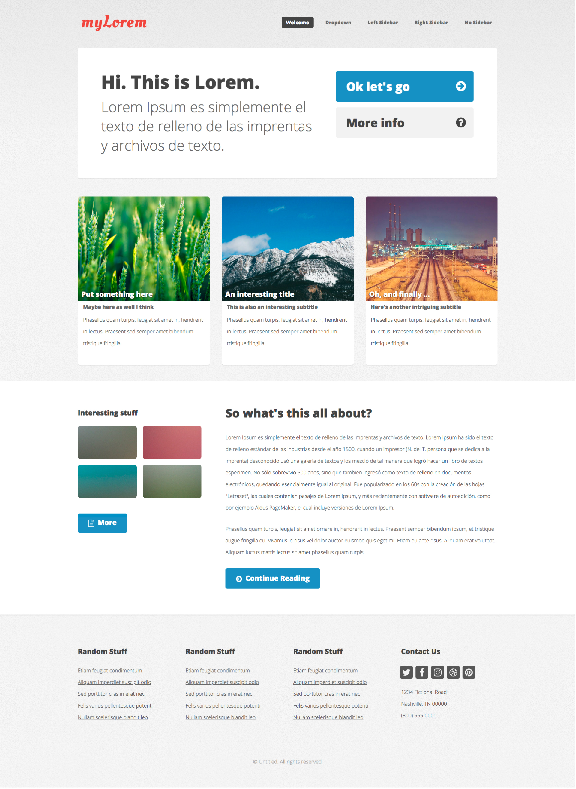

# **MAQUETADOR WEB**

## **PERFIL CARGO Y DESCRIPCIÓN DE PRUEBA TÉCNICA**

## **PERFIL DEL CARGO**

#### Maquetador web con experiencia de 6 meses en desarrollo web, con conocimientos en pug, scss, javascript y diseño responsive, que no tenga miedo a los retos y que sea ágil proponiendo soluciones.

## **Estudios y/o perfiles relacionados:**

- Técnico, tecnologo producción multimedia, integración web.
- Profesional en diseño gráfico con enfasis en diseño y desarrollo web.

## **Requisitos mínimos:**

- Conocimientos avanzado en:
  - PUG(HTML5).
  - SCSS(CSS3).
  - RWD - Responsive web design.
- Conocimientos básicos en:
  - Repositorios GIT.
  - JavaScript ( VanillaJs ).
  - Manejo del idioma inglés.

## **Se valorá el conocimiento en:**

- Metalenguajes para HTML (PUG) y CSS (SCSS).
- Desarrollo local usando nodeJs y npm.
- Ingles básico.

## **DESCRIPCIÓN DE LA PRUEBA**

- Duración: 2:00 horas.
- Se evaluará el conocimiento tecnico aplicado.
  - Que hizo (hasta donde alcanzo a hacer).
  - Como lo hizo ( que herramientas usó para maquetar).
  - Que tan claro deja el código (PUG – SCSS - JS).

#### Se necesita maquetar la sección home de un sitio web para una institución educativa. Al ingresar el usuario encontrará un copy que llame a la acción con dos botones para crear su cuenta o querer saber mas sobre el proyecto, estos botones tendrán una pequeña animación con el icono al pasar el mouse sobre ellos.

#### Se debe mostrar de manera clara, organizada y visible por lo menos 3 secciones del proyecto que son puntos a destacar. Estas manejarán imágenes, título y un texto descriptivo, se debe hacer una animación de la imagen y el título.

#### Todos los botones que tienen un icono deben tener una pequeña animación o transición del icono al pasar el mouse sobre ellos y un cambio sutil en el color del botón.

## **Notas**

1. Uso de las tipografías Oleo Script y Open sans.
2. Una textura para el fondo de la página
3. Buenas prácticas y orden en el código PUG(HTML%) y SCSS(CSS)
4. Se tiene en cuenta como plus el no uso de librerías css para el layout.
5. Minimo 10 commits en el desarrollo.
6. Al terminar la prueba enviar link del repositorio por correo a [coor_frontend@booksandbooksdigital.com.co](mailto:coor_frontend@booksandbooksdigital.com.co)

---

